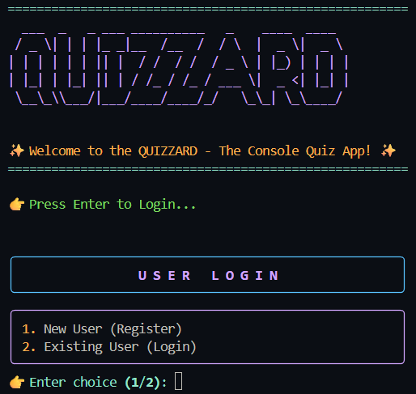
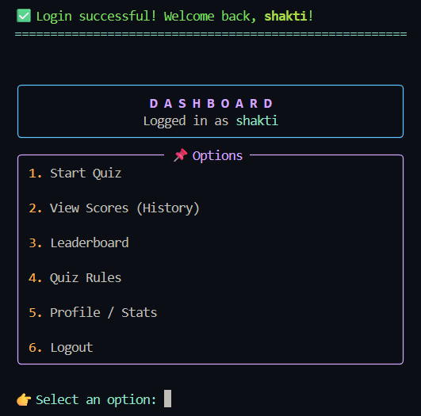

# Quizzard 🎯  
*A Console-Based Quiz Application with an Interactive UI*  

---

## 📖 Project Description  
Quizzard is a Python-based console quiz app designed with a polished interface.  It allows users to register, log in, play timed quizzes, view their stats, and track progress through achievements and leaderboards.  
The app is lightweight, fully text-based, and built for both fun and learning.  

---

## ✨ Features  
- 🔐 **User Authentication** (Register & Login system)  
- 📜 **Interactive Dashboard** with a clean UI  
- 📝 **10 Randomized Questions** per quiz attempt  
- ⏳ **Built-in Timer** for each quiz  
- 🏆 **Leaderboard** with ranks and scores  
- 📊 **Player Profile** showing quiz history and achievements  
- 🎖 **Achievements System** to encourage progress  
- 💾 **Persistent Data Storage** (users, scores, achievements)  

---

## 📸 Preview  

### Welcome Screen  
  

### Dashboard  
  

### Profile  
  

---

## 🚀 How to Run  

### 1. Clone the Repository  
```bash
git clone https://github.com/0xroot-suraj/Quizzard.git
cd Quizzard
```

## 2. Create Virtual Environment (Optional)
Create a virtual environment to keep your project dependencies isolated:
```bash
python -m venv venv
```
### Activation
- **Windows (PowerShell):**
  ```bash
  venv\Scripts\activate
  ```
- **Linux / macOS:**
  ```bash
  source venv/bin/activate
  ```
### Deactivation
To exit the virtual environment:
```bash
deactivate
```
> 💡 Once activated, any `pip install ...` command will install packages only inside this environment.

### 3. Install Dependencies
```bash
pip install -r requirements.txt
```

### 4. Run the App
```bash
python main.py
```

---

## ⚙️ Installation Notes

- Requires Python 3.8+
- Works on Windows, Linux, and Mac
- Terminal must support Unicode for emojis/icons

---

## 📂 Project Structure

```bash
Quizzard/
│── auth/             # Authentication (login, signup, logout)
│── features/         # Core quiz features
│── quiz_data/        # Quiz questions and data
│── utils/            # Helper functions
│── .gitignore        # Python ignores
│── LICENSE           # MIT License
├── README.md         # You're reading it!
│── main.py           # Entry point
└── requirements.txt  # Dependencies
```

---

## ⚖️ License
This project is licensed under the [MIT License](LICENSE).

---

## ✍️ Author
Developed with ❤️ by **Shakti Suraj** (@0xroot-suraj)

---

## 🤝 Contribution
Contributions, suggestions, and feedback are welcome!
Open an issue or submit a pull request to help improve **Quizzard**.
